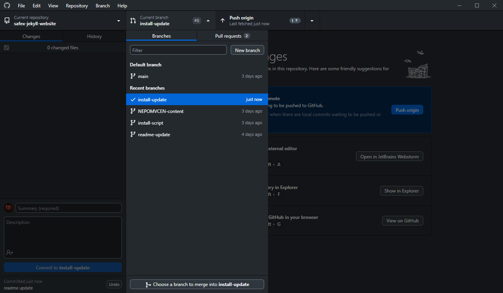
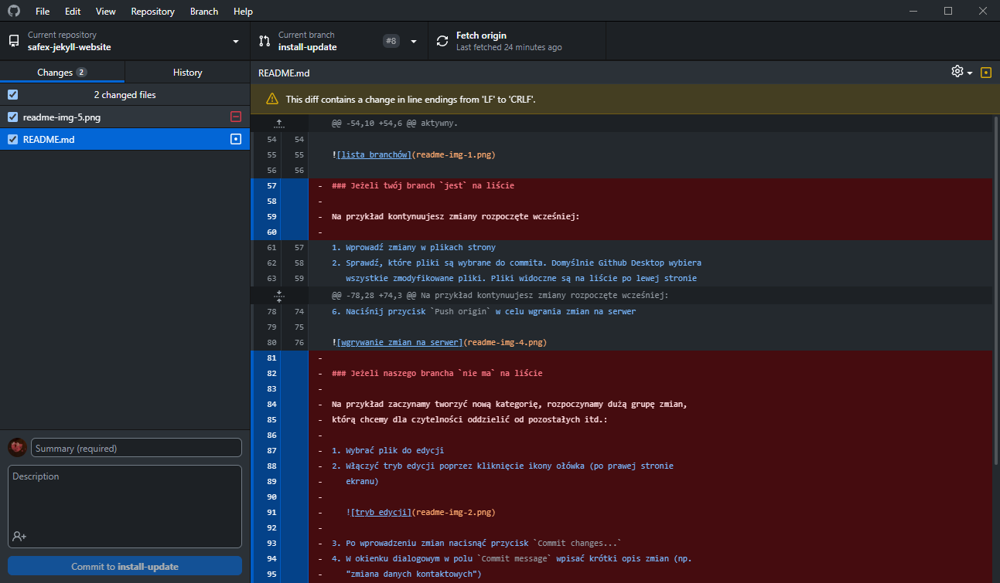
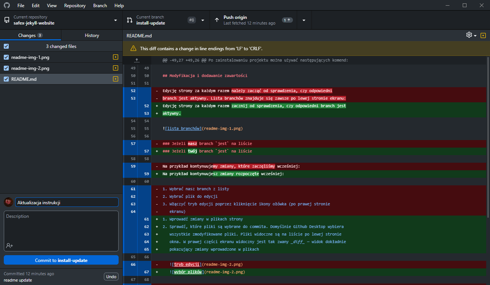
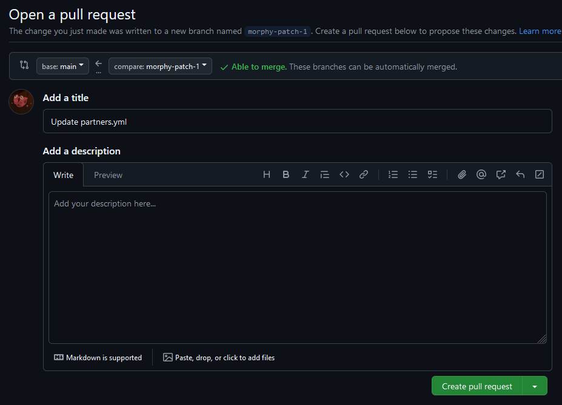
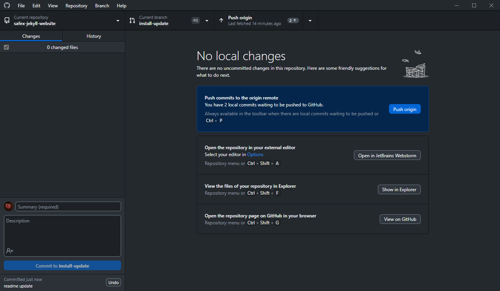

# Safex — strona wizytówka

## Struktura witryny

Witryna składa się z trzech rodzajów stron:

- strony zwykłe — zawierają zwykłą zawartość taką jak tekst lub obrazki
  - przykład: _Oferta_, _O nas_, _Kontakt_
  - adres: `strona.pl/strona-zwykła`
- strony kategorii — zawierają zdjęcie i opis kategorii usług. Stroną nadrzędną
  jest dla nich strona `Oferta`
  - przykład: _Dla służb_, _Produkty na zamówienie_, _Wyposażenie sceniczne_
  - adres: `strona.pl/oferta/strona-kategorii`
- strony usług — zawierają opis i zdjęcia usługi stroną nadrzędną jest dla nich
  strona kategorii, w której dana usługa się znajduje
  - przykład: _Siatki elewacyjne_, _Zbiorniki pożarowe_
  - adres: `strona.pl/oferta/strona-kategorii/strona-produktu`

## Modyfikacja i dodawanie zawartości

Edycję strony za każdym razem należy zacząć od sprawdzenia, czy odpowiedni
branch jest aktywny. Lista branchów znajduje się zawsze po lewej stronie ekranu:

### Jeżeli na liście branchów `nie ma` naszego brancha

Na przykład zaczynamy tworzyć nową kategorię, rozpoczynamy dużą grupę zmian,
którą chcemy dla czytelności oddzielić od pozostałych itd.:

1. Wybrać plik do edycji
2. Włączyć tryb edycji poprzez kliknięcie ikony ołówka (po prawej stronie
   ekranu)

   

3. Po wprowadzeniu zmian nacisnąć przycisk `Commit changes...`
4. W okienku dialogowym w polu `Commit message` wpisać krótki opis zmian (np.
   "zmiana danych kontaktowych")
5. Na dole wybrać opcję `Create a new branch for this commit`
6. Wpisać nazwę nowego brancha
7. Nacisnąć przycisk `Propose changes`

   

8. Po utworzeniu brancha wybrać opcję `Create pull request` - zostanie utworzone
   żądanie połączenia utworzonego brancha z branchem głównym

   

### Jeżeli nasz branch `jest` na liście branchów

Np. kontynuujemy zmiany, które zaczęliśmy wcześniej:

1. Wybrać nasz branch z listy
2. Wybrać plik do edycji
3. Włączyć tryb edycji poprzez kliknięcie ikony ołówka (po prawej stronie
   ekranu)

   

4. Po wprowadzeniu zmian nacisnąć przycisk `Commit changes...`
5. W okienku dialogowym w polu `Commit message` wpisać krótki opis zmian (np.
   "zmiana danych kontaktowych")
6. Na dole wybrać opcję `Commit directly to the (nazwa brancha) branch`
7. Nacisnąć przycisk `Propose changes`

   
